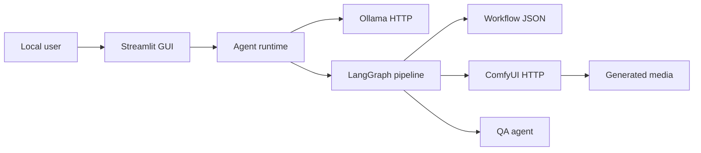

# Agent Platform Threat Model

## Executive Summary

The project is a local-first Streamlit application that coordinates a LangGraph video generation pipeline using local Ollama and ComfyUI services. The highest-risk areas are local service exposure, workflow JSON loading and prompt submission to ComfyUI, hardcoded local execution paths, generated media handling, and denial-of-service from expensive render jobs.

## Scope And Assumptions

In scope:

- `agent-platform/app_robust.py`
- `agent-platform/src/multi_agent_video/**`
- `agent-platform/scripts/**`
- Root ComfyUI workflow JSON files
- Local `.env` configuration shape, without exposing secret values

Assumptions:

- This is currently a local development tool, not an internet-facing multi-user SaaS.
- Streamlit, Ollama, and ComfyUI are intended to bind to localhost.
- Generated images/videos are stored locally, primarily under `E:\AI`.
- No authentication or user accounts are implemented yet.

Open questions that would change risk ranking:

- Will the Streamlit app be exposed on LAN or the public internet?
- Will untrusted users upload workflows, images, prompts, or videos?
- Will the platform later support per-user projects, billing, or shared workspaces?

## System Model

### Primary Components

- Streamlit GUI: `agent-platform/app_robust.py`
- Runtime factory: `agent-platform/src/multi_agent_video/chat_hub.py`
- LangGraph pipeline: `agent-platform/src/multi_agent_video/graph.py`
- Local LLM client: `agent-platform/src/multi_agent_video/local_llm.py`
- ComfyUI client: `agent-platform/src/multi_agent_video/comfyui_client.py`
- Agent implementations: `agent-platform/src/multi_agent_video/agents/*.py`
- Workflow templates: root `workflow_*.json` files

### Data Flows And Trust Boundaries

- User -> Streamlit GUI: prompt text and seed enter via browser UI. No authentication, authorization, rate limiting, or input length limiting is present.
- Streamlit GUI -> Local LLM: prompts are sent to Ollama via HTTP at `LOCAL_LLM_BASE_URL`.
- Streamlit GUI -> LangGraph pipeline: scene, prompt, builder, render, QA state is passed through in-process Python objects.
- Pipeline -> Workflow JSON: configured workflow path is read from disk and parsed as JSON.
- Pipeline -> ComfyUI: generated workflow payload is submitted to `/prompt` over HTTP.
- ComfyUI -> Local output folder: generated frames are read back from local ComfyUI output paths.

#### Diagram

## Assets And Security Objectives

| Asset | Why it matters | Objective |
| --- | --- | --- |
| Local machine and GPU | ComfyUI renders can consume CPU/GPU for long periods | Availability |
| Workflow JSON | Controls ComfyUI node graph and render behavior | Integrity |
| Prompt content | May contain private creative briefs | Confidentiality |
| Generated media | User-created content and outputs | Confidentiality, integrity |
| `.env` config | Contains local paths and possible future credentials | Confidentiality |
| Local services | Ollama and ComfyUI APIs can run expensive jobs | Availability, integrity |

## Attacker Model

Capabilities:

- If exposed beyond localhost, a remote user could submit prompts, trigger renders, and interact with service APIs.
- A local user or malware with filesystem access could modify workflow JSON or `.env`.
- A malicious prompt could try to influence LLM-generated JSON used by downstream agents.

Non-capabilities under current local-only assumptions:

- No direct code execution through uploaded plugins was found in the app code.
- No internet-facing authentication bypass applies if Streamlit is kept local-only.
- No database or multi-tenant data isolation boundary exists yet.

## Entry Points And Attack Surfaces

| Surface | How reached | Boundary | Notes | Evidence |
| --- | --- | --- | --- | --- |
| Streamlit chat and text area | Browser UI | User to app | Accepts free-form prompts | `agent-platform/app_robust.py` |
| ComfyUI launch button | Browser UI | App to local process | Starts hardcoded batch file | `launch_comfyui` in `app_robust.py` |
| Ollama HTTP API | App HTTP client | App to local service | Sends prompt content | `LocalLLM.chat` |
| ComfyUI HTTP API | App HTTP client | App to local service | Submits full workflow | `ComfyUIClient.submit_prompt` |
| Workflow file path | `.env` / defaults | Config to filesystem | Reads JSON from configured path | `AppConfig.comfyui_workflow_path` |
| Generated media display | ComfyUI output path | Filesystem to UI | Reads local image paths | `app_robust.py` |

## Top Abuse Paths

1. Expose Streamlit on a network, then an unauthenticated user repeatedly triggers GPU-heavy renders, exhausting local GPU/CPU.
2. Modify `.env` to point `COMFYUI_WORKFLOW_PATH` at an unexpected JSON file, causing unintended ComfyUI jobs or broken renders.
3. Modify workflow JSON to use unexpected custom nodes, then submit through the trusted app path.
4. Send extremely large prompts or many chat messages, causing local LLM latency, memory growth, or UI instability.
5. Expose ComfyUI directly on LAN/public network, bypassing the Streamlit checks and submitting arbitrary ComfyUI prompts.
6. Leak prompt or output paths through verbose exception details shown in the UI.

## Threat Model Table

| Threat ID | Threat source | Threat action | Impact | Existing controls | Gaps | Recommended mitigations | Likelihood | Impact | Priority |
| --- | --- | --- | --- | --- | --- | --- | --- | --- | --- |
| TM-001 | Network user if app is exposed | Trigger repeated render jobs | GPU/CPU denial of service | Local-first defaults | No auth, quotas, or rate limits | Keep localhost-only by default; add auth before LAN/public use; add max concurrent jobs | Medium | High | High |
| TM-002 | Local user or compromised config | Point workflow path to unsafe/unexpected JSON | Integrity loss or failed renders | JSON parsing only | No allowlist or schema validation | Restrict workflows to a known directory; validate expected node IDs/classes | Medium | Medium | Medium |
| TM-003 | Prompt user | Prompt-inject local LLM outputs used by agents | Low-quality or unexpected workflow prompts | Pydantic model validation | Minimal semantic constraints | Enforce length limits and structured output validation; reject oversized prompts | Medium | Medium | Medium |
| TM-004 | Network user if ComfyUI exposed | Submit arbitrary jobs directly to ComfyUI | GPU DoS or unwanted outputs | App health check only | ComfyUI exposure is outside app control | Document and verify ComfyUI binds to localhost; firewall port 8188 | Medium | High | High |
| TM-005 | Local app error path | Expose filesystem paths and stack traces in UI | Local information disclosure | Helpful debug output | Debug details shown to UI users | Gate traceback display behind debug mode | Low | Medium | Low |

## Criticality Calibration

- Critical: public unauthenticated remote code execution, exposed credentials, or cross-user data theft after multi-user support exists.
- High: unauthenticated public render abuse, direct public ComfyUI exposure, or unsafe workflow execution through untrusted custom nodes.
- Medium: workflow integrity problems, prompt injection affecting generated assets, or local path disclosure.
- Low: local-only debug leakage and quality/reliability issues without confidentiality or availability impact.

## Focus Paths For Security Review

| Path | Why it matters | Related Threat IDs |
| --- | --- | --- |
| `agent-platform/app_robust.py` | Main UI entry point and ComfyUI process launcher | TM-001, TM-005 |
| `agent-platform/src/multi_agent_video/comfyui_client.py` | Submits workflows to ComfyUI | TM-002, TM-004 |
| `agent-platform/src/multi_agent_video/graph.py` | Reads workflow and writes debug output | TM-002 |
| `agent-platform/src/multi_agent_video/local_llm.py` | Sends user prompts to local LLM | TM-003 |
| `agent-platform/src/multi_agent_video/agents/builder_agent.py` | Injects prompts and seed into workflow nodes | TM-002, TM-003 |
| `agent-platform/.env.example` | Documents local service and workflow paths | TM-002, TM-004 |

## Quality Check

- Entry points discovered: Streamlit UI, local HTTP clients, workflow file loading, output display.
- Trust boundaries covered: user to GUI, GUI to Ollama, pipeline to workflow files, pipeline to ComfyUI, ComfyUI to local media.
- Runtime behavior separated from dev tooling.
- Assumptions are explicit because deployment context has not been finalized.
